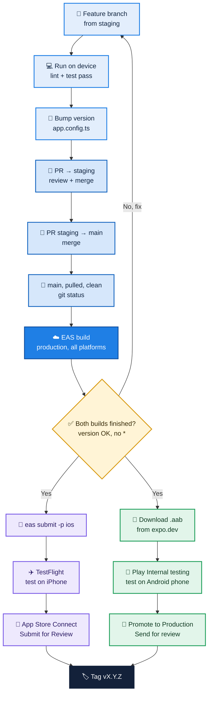

# SamuraiTax Mobile — Release Process

How to take a change from a Linear issue to App Store and Google Play review.

## Golden rules

1. **Production builds come from `main` only.** Never from `staging` or a feature branch.
2. **Build from a clean, pulled checkout.** `git status` must say `working tree clean`. On expo.dev the build's commit must show **no `*`**.
3. **Commit the version bump before building.** The version is baked into the build.
4. **Test every store build first** — TestFlight (iOS) and Internal testing (Android).
5. **Never edit build numbers.** EAS increments them automatically.
6. **Tag every release** (`vX.Y.Z`) so anyone can find the exact code that shipped.

## Branches

| Branch | Purpose |
|---|---|
| `feature/*` (Linear name) | One issue, one branch. Created from `staging`. |
| `staging` | Integration and QA. Preview builds come from here. |
| `main` | Equals what is live in the stores. Production builds only. |

`staging` → `main` is merged on every release day, plus a weekly sync on Fridays.

## Build profiles (`eas.json`)

| Profile | Bundle ID | Use | Command |
|---|---|---|---|
| `development` | `com.samuraitax.dev` | Dev client for developers | `npx eas build --profile development --platform ios` |
| `ios-simulator` | `com.samuraitax.dev` | Dev client for iOS Simulator | `npx eas build --profile ios-simulator --platform ios` |
| `preview` | `com.samuraitax.preview` | QA builds from `staging` | `npx eas build --profile preview --platform all` |
| `production` | `com.samuraitax` | App Store / Google Play | `npx eas build --profile production --platform all` |

The **profile** decides what kind of app is built. The **branch** decides which code goes in.

## Versioning

- `version` in `app.config.ts` is what users see (e.g. `1.1.2`).
  - Patch (`1.1.x`): fixes and small UI changes
  - Minor (`1.x.0`): new features
  - Major (`x.0.0`): breaking changes
- Build numbers (iOS build number, Android `versionCode`) are managed by EAS (`autoIncrement` + `appVersionSource: remote`). Do not edit them.
- `runtimeVersion` follows the app version. A new version means a new runtime, so OTA updates for the old version do not reach the new one.

## Release flow



## Steps

### 1. Code (per Linear issue)

```bash
git switch staging && git pull
git switch -c <branch-name-from-linear>
```

1. Make the change.
2. Run on a real iPhone: `npx expo run:ios --device`
   - After a native change (new native module, Expo upgrade): `npx expo prebuild --clean --platform ios` first, then re-select the signing team (TAIMATSU CO., LTD.) in Xcode.
3. `npx expo lint` (0 errors) and `npm test` (all pass).
4. Releasing? Set `version` in `app.config.ts` and commit it separately: `chore: bump version to X.Y.Z`
5. Push, open a PR into `staging`, get it reviewed, merge.

### 2. Prepare the release

1. Open a PR `staging` → `main` and merge it.
2. Get a clean checkout:

```bash
git switch main
git pull
git status   # must say: working tree clean
```

### 3. Build

```bash
npx eas build --profile production --platform all
```

The build runs in Expo's cloud. On **expo.dev → Builds**, confirm both iOS and Android builds:

- [ ] Status: Finished
- [ ] Version: X.Y.Z
- [ ] Profile: production
- [ ] Commit hash without `*`

### 4. iOS — TestFlight, then review

```bash
npx eas submit -p ios --latest
```

1. **App Store Connect → TestFlight**: wait for Apple processing, install on an iPhone, test.
2. **Distribution**: create version X.Y.Z, select the build, write "What's New", **Submit for Review**.

### 5. Android — Internal testing, then review

1. **expo.dev → Builds → Android build → Download** the `.aab`.
2. **Play Console → Test and release → Testing → Internal testing → Create release**, upload the `.aab`.
3. Install on the test phone via the internal testing opt-in link, test.
4. **Promote the release to Production**, add release notes, **Send for review**.

### 6. After release

```bash
git tag vX.Y.Z
git push origin vX.Y.Z
```

## Good to know

- **Android signing:** the upload keystore is stored on EAS (expo.dev → Credentials → Android → `com.samuraitax`). Its SHA-1 matches Play Console's upload key certificate. Never delete it.
- **No Android Studio or Xcode needed to release.** EAS builds both platforms in the cloud. Xcode is only for running the app locally.
- **`ios/` and `android/` are generated and gitignored.** EAS runs its own prebuild from `app.config.ts`. Your local folders never affect store builds.
- **`eas build` uses your local files, not GitHub.** That is why rule 2 exists.
- **CI (`.github/workflows`)** runs Lint, Test and an EAS Update on every PR. The update is published with no channel, so it never reaches installed apps.
